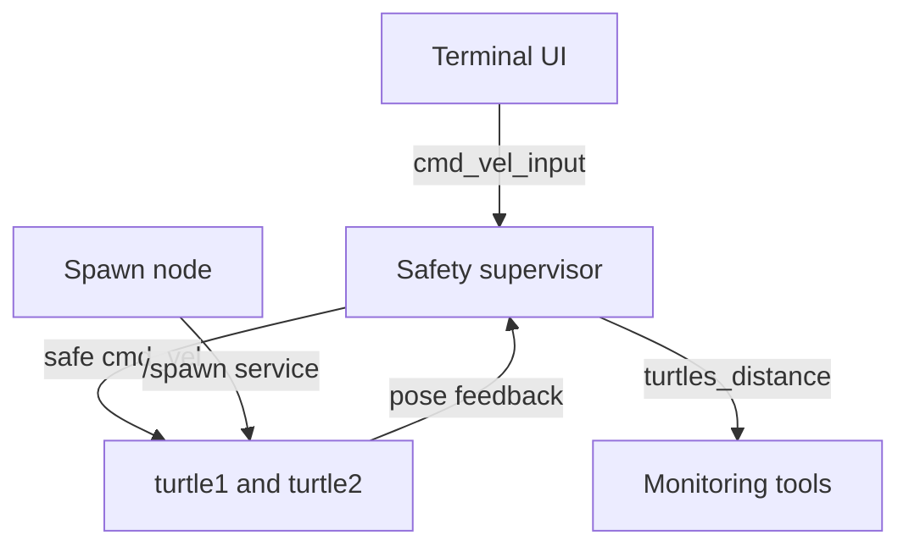

<div align="center">

# ROS 2 Multi-Turtle Safety Controller

**A multi-node ROS 2 system for commanding two turtles while enforcing collision-distance and workspace-boundary safety rules.**

<p>
  
  
  
  
</p>

</div>

---

## Overview

This project implements a supervisory safety layer for two independently commanded robots in **ROS 2 turtlesim**. A terminal-based user interface sends linear and angular velocity requests, while a dedicated safety node monitors both turtle poses and decides whether to forward or override those commands.

The supervisor continuously calculates the Euclidean distance between the turtles, responds to unsafe proximity, detects workspace-boundary violations, and performs automatic recovery turns. A separate Python node creates the second turtle through the turtlesim `/spawn` service.

The design separates **user intent** from **safe actuation**: commands are published first to intermediate input topics and reach the turtles only after passing through the safety controller.

## Key Features

| Capability | Implementation |
| --- | --- |
| Multi-robot control | Independent terminal commands for `turtle1` and `turtle2` |
| Safety supervision | User commands pass through a central C++ control node |
| Distance monitoring | Real-time Euclidean separation calculated from both poses |
| Collision mitigation | Automatic separation manoeuvre below a configurable threshold |
| Boundary protection | Detection of configurable minimum and maximum workspace limits |
| Automatic recovery | Approximate 180-degree turn after reaching a boundary |
| Observability | Inter-turtle distance published as a ROS 2 topic |
| Mixed-language ROS 2 package | C++ control nodes and a Python service client |

## System Architecture



The safety node acts as a command filter between the operator and turtlesim:

1. The UI publishes a requested velocity to the selected turtle's input topic.
2. The supervisor reads both requested commands and both turtle poses.
3. Safe commands are forwarded to the standard turtlesim velocity topics.
4. Unsafe conditions trigger an override for separation or boundary recovery.
5. The measured distance is published for inspection and visualization.

## Safety Behaviour

### Inter-Turtle Separation

The supervisor calculates:

```text
distance = sqrt((x1 - x2)^2 + (y1 - y2)^2)
```

When the distance falls below `dist_limit`, normal commands are temporarily replaced by opposing linear and angular velocities that move the turtles apart.

### Boundary Recovery

Each turtle is monitored against configurable rectangular workspace limits. When a turtle reaches a boundary, the supervisor:

1. stops normal forward motion;
2. commands a fixed angular velocity;
3. performs an approximate 180-degree turn;
4. stops and waits for a new user command.

A reset margin prevents the same boundary contact from being triggered repeatedly before the turtle has moved comfortably back inside the workspace.

### Default Parameters

| Parameter | Default | Purpose |
| --- | ---: | --- |
| `dist_limit` | `0.75` | Minimum allowed distance between turtles |
| `border_min` | `1.0` | Minimum safe x/y coordinate |
| `border_max` | `10.0` | Maximum safe x/y coordinate |
| `margin` | `0.5` | Interior margin used to reset boundary state |
| Supervisor period | `20 ms` | Safety-loop interval, equivalent to 50 Hz |
| Recovery angular velocity | `1.5 rad/s` | Fixed boundary-turn command |
| Recovery duration | Approximately `2.1 s` | 105 control ticks for an approximate half-turn |
| Separation duration | Approximately `0.6 s` | 30 control ticks per separation manoeuvre |

ROS parameters can be changed at runtime startup. For example:

```bash
ros2 run assignment1_rt distance --ros-args \
  -p dist_limit:=1.0 \
  -p border_min:=1.2 \
  -p border_max:=9.8
```

## ROS 2 Nodes

| Node | Language | Responsibility |
| --- | --- | --- |
| `simple_spawner` | Python | Creates `turtle2` using the `/spawn` service |
| `ui_node` | C++ | Reads terminal input and publishes velocity requests |
| `distance_node` | C++ | Monitors poses, measures separation, and enforces safety rules |

## ROS 2 Interfaces

### Subscriptions

| Topic | Type | Consumer |
| --- | --- | --- |
| `/turtle1/pose` | `turtlesim/msg/Pose` | Safety supervisor |
| `/turtle2/pose` | `turtlesim/msg/Pose` | Safety supervisor |
| `/turtle1/cmd_vel_input` | `geometry_msgs/msg/Twist` | Safety supervisor |
| `/turtle2/cmd_vel_input` | `geometry_msgs/msg/Twist` | Safety supervisor |

### Publications

| Topic | Type | Purpose |
| --- | --- | --- |
| `/turtle1/cmd_vel` | `geometry_msgs/msg/Twist` | Safety-filtered command for `turtle1` |
| `/turtle2/cmd_vel` | `geometry_msgs/msg/Twist` | Safety-filtered command for `turtle2` |
| `/turtles_distance` | `std_msgs/msg/Float32` | Current Euclidean distance between turtles |

### Service

| Service | Type | Purpose |
| --- | --- | --- |
| `/spawn` | `turtlesim/srv/Spawn` | Creates the second turtle at `(7.0, 7.0, 0.0)` |

## Repository Structure

```text
ros2-turtlesim-safety-controller/
├── src/
│   ├── distance.cpp        # Safety supervisor and distance monitor
│   └── ui.cpp              # Terminal velocity-command interface
├── scripts/
│   └── turtle_spawn.py     # Python client for the turtlesim spawn service
├── CMakeLists.txt
├── package.xml
└── README.md
```

## Requirements

- Ubuntu 24.04, native or WSL 2
- ROS 2 Jazzy
- C++17-compatible compiler
- Python 3
- `colcon` and `rosdep`
- ROS 2 `turtlesim`

Install turtlesim if it is not already available:

```bash
sudo apt update
sudo apt install ros-jazzy-turtlesim
```

## Build

Clone the package into a ROS 2 workspace:

```bash
mkdir -p ~/ros2_ws/src
cd ~/ros2_ws/src
git clone https://github.com/egjinaj/ros2-turtlesim-safety-controller.git
cd ~/ros2_ws
```

Install dependencies and build:

```bash
source /opt/ros/jazzy/setup.bash
rosdep install --from-paths src --ignore-src -r -y
colcon build --packages-select assignment1_rt --symlink-install
source install/setup.bash
```

## Run the Project

Open four terminals. In each new terminal, source ROS 2 and the workspace first:

```bash
source /opt/ros/jazzy/setup.bash
source ~/ros2_ws/install/setup.bash
```

### Terminal 1 - Start turtlesim

```bash
ros2 run turtlesim turtlesim_node
```

### Terminal 2 - Spawn the second turtle

```bash
ros2 run assignment1_rt turtle_spawn
```

### Terminal 3 - Start the safety supervisor

```bash
ros2 run assignment1_rt distance
```

### Terminal 4 - Start the user interface

```bash
ros2 run assignment1_rt ui
```

The terminal interface asks for:

1. the turtle name: `turtle1` or `turtle2`;
2. linear velocity;
3. angular velocity.

Each requested command is active for approximately one second before the UI publishes a stop command. Enter `q` when prompted for the turtle name to exit.

## Inspect the Running System

```bash
# Watch the measured distance
ros2 topic echo /turtles_distance

# Inspect pose feedback
ros2 topic echo /turtle1/pose
ros2 topic echo /turtle2/pose

# Inspect the ROS computation graph
rqt_graph

# List the configurable safety parameters
ros2 param list /distance_node
```

## Design Decisions

- **Intermediate command topics** prevent the user interface from bypassing the safety layer.
- **Centralized supervision** allows one node to reason about both robots simultaneously.
- **A 50 Hz control loop** provides regular safety checks independently of terminal-input timing.
- **Parameterised thresholds** allow the safe distance and workspace bounds to be adjusted without recompilation.
- **Hysteresis through an interior margin** reduces repeated boundary-trigger events.
- **Separate spawning, interaction, and safety nodes** keep responsibilities modular.

## Scope and Limitations

This project demonstrates ROS 2 communication and supervisory safety logic in turtlesim. It is not a complete multi-robot navigation stack.

- Separation uses a fixed heuristic manoeuvre rather than trajectory planning.
- Boundary recovery uses a timed turn rather than closed-loop orientation control.
- User commands are discrete one-second velocity requests.
- The system does not predict future collisions.
- No global planner, localization system, or obstacle map is used.
- Behaviour is designed for turtlesim rather than physical robots.

## Potential Extensions

- Add a single launch file for the complete system
- Replace timed turns with pose-feedback orientation control
- Add predictive collision checking
- Visualize safety states and distance thresholds
- Record distance and intervention statistics with rosbag
- Add automated ROS 2 integration tests
- Generalize the supervisor to an arbitrary number of robots

## Author

**Endri Gjinaj**  
MSc Robotics Engineering student, University of Genoa  
[GitHub Profile](https://github.com/egjinaj)

---

<div align="center">
  <sub>Built to explore ROS 2 node communication, command arbitration, and multi-robot safety supervision.</sub>
</div>
